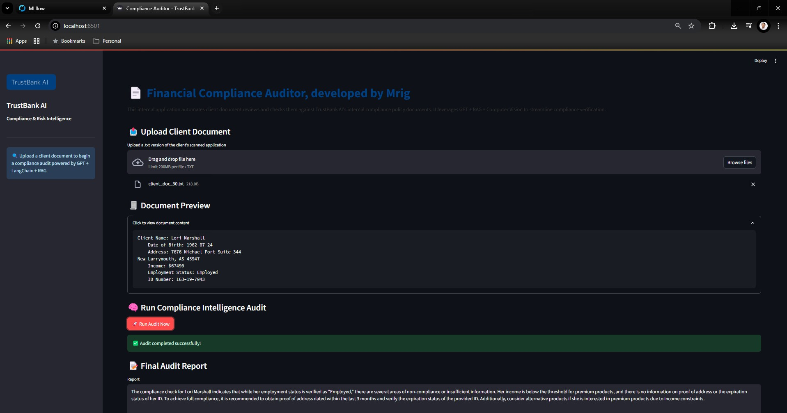

# 🏦 Financial Compliance Auditor — powered by GPT, RAG, ML & CV


**An enterprise-grade AI system to automate compliance audits from unstructured client documents.**  
Built with GPT-4, LangChain Agents, MLflow, Computer Vision, and local Retrieval-Augmented Generation (RAG).

---

## 🚀 Overview

The **Financial Compliance Auditor** is an AI-powered assistant that:
- Extracts structured data from scanned client documents
- Checks compliance against internal bank policies
- Generates a detailed, professional audit report in seconds

It simulates a real-world internal tool used by banks, insurers, or fintechs to reduce manual compliance effort and improve risk accuracy.

---

## 🎯 Business Impact

> 💰 Saves ~$2.8M/year by automating 60–70% of manual compliance checks  
> ⚡ Speeds up audits from hours to seconds  
> 🧠 Enables intelligent policy reasoning via local RAG + LLMs

---

## 🧠 Key Features

| Feature | Description |
|--------|-------------|
| 🧾 Document Parsing | Extract data from scanned `.txt` client files (simulated OCR) |
| 🤖 LangChain Agents | Multi-agent LLM workflow: Extractor + Compliance Verifier |
| 📚 Local RAG | Retrieves matching policies from stored documents using FAISS |
| 📊 ML Model | Classifies client risk using Random Forest, tracked in MLflow |
| 🎛️ Streamlit UI | Executive-grade front-end with branding, CTA, and reporting |
| 🧠 GPT-4 API | OpenAI API powers intelligent analysis and reporting |

---

## 🛠️ Tech Stack

- **OpenAI GPT-4 API** (via `langchain`)
- **LangChain Agents**
- **Local RAG** (FAISS or ChromaDB)
- **Streamlit** (UI)
- **MLflow** (for ML tracking)
- **scikit-learn** (model training)
- **pytesseract + OpenCV** (OCR-ready)
- **Chroma / FAISS** (vector DB)

---

## 📂 Project Structure

```bash
financial_compliance_auditor/
├── data/                    # Dummy data for client docs, policies, features
├── models/                 # Trained ML model (.pkl)
├── src/
│   ├── data_creation.py
│   ├── document_processing.py
│   ├── build_vector_store.py
│   ├── train_ml_model.py
│   ├── langchain_agents.py
│   └── __init__.py
├── streamlit_app.py       # Streamlit UI app
├── assets/bank_logo.png     # Dummy bank logo
├── requirements.txt
├── .env                     # Store OpenAI key here
└── README.md

```

🖼️ Demo Screenshot


📽️ Video Demo
🎥 Watch the 30-sec app demo — (https://tinyurl.com/appdemomrig)

🤝 Connect with Me
Mrig Debsarma
💼 Data Science & AI | Financial Services
📍 Sydney, Australia
📧 LinkedIn : https://www.linkedin.com/in/mrigendranath/

⭐ If you liked this project...
Please ⭐️ the repo and share feedback!
Helps me connect with people hiring in AI/ML, LLMs, and analytics in Australia and globally.